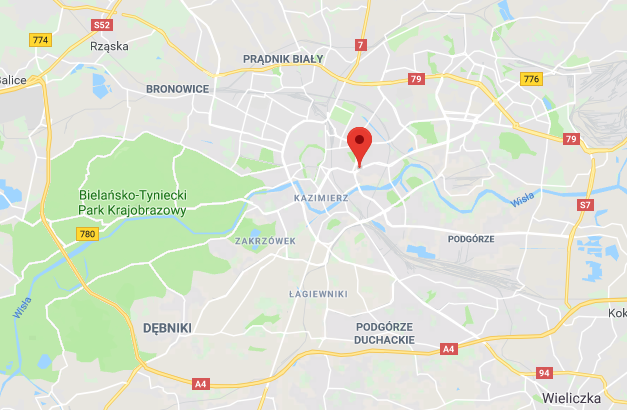

## Learning python for data science - using air pollution [data from Kaggle](https://www.kaggle.com/datascienceairly/air-quality-data-from-extensive-network-of-sensors) in Krakow.

MVP version uses one sensor [location](https://www.google.pl/maps/place/50%C2%B003'27.9%22N+19%C2%B057'41.0%22E/@50.0565663,19.9487898,14.75z/data=!4m5!3m4!1s0x0:0x0!8m2!3d50.057748!4d19.961375) 

---
#####Tools used:
- [pandas](https://pandas.pydata.org/)
- [matplotlib](https://matplotlib.org/)
- [numpy](http://www.numpy.org/)

####Learning resources:
- [Machine learning course by Andrew Ng](https://www.coursera.org/learn/machine-learning/home/welcome)
- [Siraj Raval AI and data-science materials](https://www.youtube.com/channel/UCWN3xxRkmTPmbKwht9FuE5A)
- [Python tutorials by Santdex](https://www.youtube.com/channel/UCfzlCWGWYyIQ0aLC5w48gBQ)