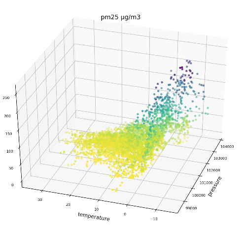

## Learning python for data science - using air pollution [data from Kaggle](https://www.kaggle.com/datascienceairly/air-quality-data-from-extensive-network-of-sensors) in Krakow.

#### Locations of sensors

---

#### Aim:
to get to know basics of data visualzation using common python tools, manipulate and compose dataframes from scattered csv files.

#### Tools used:
- [pandas](https://pandas.pydata.org/)
- [matplotlib](https://matplotlib.org/)

#### Example visuallizations:

